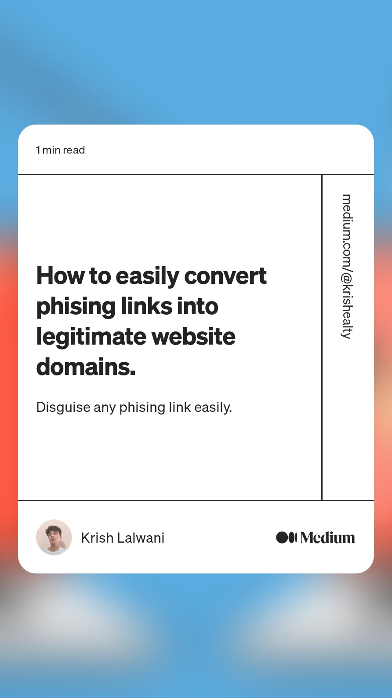

## HideMePlease
<p align="center">
	
</p>
<p align="center">
HideMePlease is a tool that can hide Phising web links into custom legitimate links (eg: facebook.com, instagram.com) by using ccTLD Disguise method. 
</p>

## Installation 

```
git clone https://github.com/krishealty/hidemeplease
```

```
cd hidemeplease 
```

```
bash hidemeplease.sh
```

Find more about the tool in the [Medium article](https://medium.com/@krishealty/how-to-easily-convert-phising-links-into-legitimate-website-domains-5a8fbd4dbe5a)

<p align="center">

</p>
